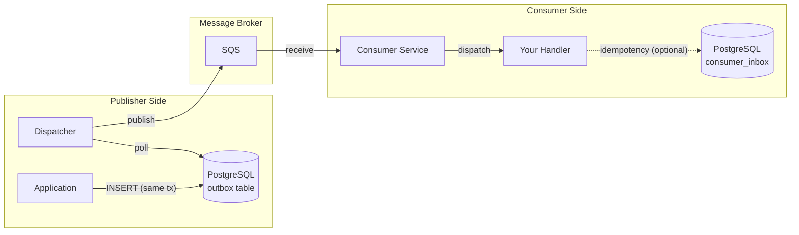
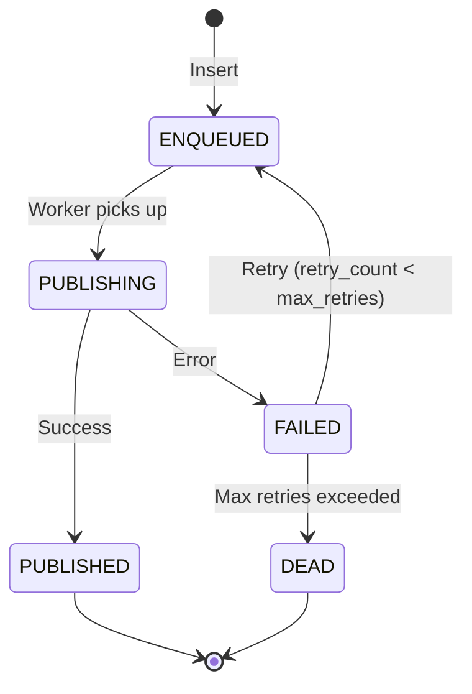

# o4x

<table style="border-collapse: collapse; border: none;">
<tr>
<td width="200" style="border: none;">

</td>
<td style="border: none;">

**Transactional Outbox + SQS event delivery platform for Go.**

*o4x is pronounced "outbox"*

o4x provides reliable message delivery from PostgreSQL to SQS using the [transactional outbox pattern](https://microservices.io/patterns/data/transactional-outbox.html). It ensures **at-least-once** delivery by storing events in the same database transaction as your business logic, then reliably delivering them to SQS. Application handlers must be idempotent.

</td>
</tr>
</table>

[](https://github.com/hacomono-lib/o4x/actions/workflows/test.yml)
<!-- TODO: パブリックリポジトリ化後に追加
[](https://codecov.io/gh/hacomono-lib/o4x)
[](https://pkg.go.dev/github.com/hacomono-lib/o4x)
[](https://goreportcard.com/report/github.com/hacomono-lib/o4x)
-->

## Features

- **Transactional Outbox Pattern** - Atomic writes with your business data
- **SQS Support (Standard & FIFO)** - Choose between high throughput or ordered delivery
- **Batch Processing** - High throughput with `SendMessageBatch`
- **Graceful Shutdown** - Context-aware shutdown with proper cleanup
- **Pluggable Repository** - pgx and GORM adapters included
- **Concurrent Workers** - Configurable parallelism for both dispatcher and consumer
- **Thread-Safe** - All components safe for concurrent use with proper synchronization

## Installation

```bash
go get github.com/hacomono-lib/o4x
```

## Architecture

o4x consists of two independent components:



### Event Type Routing

**CRITICAL CLARIFICATION:**

In o4x, `event_type` is a **logical routing key**, NOT a broker-level topic (SNS/Kafka).

o4x does NOT support fan-out by design. Each message is delivered to exactly one consumer (point-to-point pattern).

- **Event-Type-based Routing**: Different event types → different handlers (1 event_type → 1 handler)
- **Fan-Out**: Same event → multiple handlers (1 message → N handlers) - **NOT SUPPORTED**

For fan-out patterns, use SNS + multiple SQS queues OR Kinesis/Kafka instead.

### 1. Outbox (Publisher Side)

The core outbox pattern implementation. Your application inserts messages into the `outbox` table within the same database transaction as your business logic. The Dispatcher polls for pending messages and publishes them to SQS.

#### Outbox Status Flow (5 states)



**Common scenarios:**
- **Normal flow**: App inserts → Dispatcher polls → SQS publish succeeds → PUBLISHED
- **Temporary failure**: Network error during publish → FAILED → RequeueFailed retries → ENQUEUED → retry
- **Permanent failure**: 5 consecutive failures → DEAD (no more retries, OnMessageDead hook called)
- **Crash during publishing**: Process killed while PUBLISHING → ReviveStuckPublishing on restart → FAILED → retry
- **Oversized message**: 300KB payload exceeds SQS 256KB limit → immediately DEAD (PermanentError)

**Operational actions:**
- **FAILED**: Usually auto-recovers via RequeueFailed. Check `error_message` for network/auth issues. Reset retry count if needed: `UPDATE outbox SET retry_count = 0 WHERE id = '...'`
- **DEAD**: Alert immediately. Query cause: `SELECT id, event_type, error_message, payload FROM outbox WHERE status = 'DEAD'`. Options: (1) Fix payload and re-enqueue, (2) Manual publish to SQS, (3) Archive/delete if invalid.

### 2. Consumer (SQS-specific, Optional)

An optional component for processing SQS messages. Handlers must be **idempotent** since SQS provides at-least-once delivery.

**Note:** The consumer is SQS-specific and located at `contrib/sqs/consumer`. If you use Kafka or other message brokers, they typically manage consumption state internally (e.g., Kafka offsets).

## Quick Start

### 1. Create Database Tables

Use the schema generator to create the required tables:

```go
import "github.com/hacomono-lib/o4x/schema"

// Generate DDL for outbox table
outboxDDL := schema.OutboxDDL("outbox")

// Generate DDL for consumer inbox (optional, for idempotency)
inboxDDL := schema.ConsumerInboxDDL("consumer_inbox")

// Execute the SQL against your database
```

Or use the CLI tool:

```bash
go run github.com/hacomono-lib/o4x/cmd/o4x-schema@latest
```

### 2. Enqueue Messages

Insert messages into the outbox table within your business transaction:

```go
import (
    "github.com/hacomono-lib/o4x/core"
    "github.com/hacomono-lib/o4x/contrib/pgx"
)

// Create repository
repo := pgx.NewOutboxRepository(pool)

// Start database transaction
tx, err := pool.Begin(ctx)
if err != nil {
    return err
}
defer tx.Rollback(ctx)

// Execute your business logic
if _, err := tx.Exec(ctx, "INSERT INTO users (id, name) VALUES ($1, $2)", userID, userName); err != nil {
    return err
}

// Insert message to outbox within the same transaction
if _, err := repo.WithTx(tx).Insert(ctx, core.OutboxInsertParams{
    EventType:      "user.created",
    Payload:        json.RawMessage(`{"user_id": "123"}`),
    IdempotencyKey: "user-123-created",
    MaxRetries:     10,
}); err != nil {
    return err
}

// Commit both operations atomically
if err := tx.Commit(ctx); err != nil {
    return err
}
```

**Important:** Always use `WithTx()` to ensure your business logic and outbox insertion are atomic. If the transaction rolls back, the message won't be sent.

#### Metadata (Optional)

The `Metadata` field (JSONB) can store additional context that travels with the message. Common use cases:

- **Distributed Tracing** - `trace_id`, `span_id` for OpenTelemetry/Datadog/Jaeger
- **Custom Headers** - Values to map to SQS MessageAttributes
- **Routing Hints** - Priority, tenant ID, or other routing metadata
- **Audit Context** - User ID, request ID, or correlation ID

### 3. Run the Dispatcher

**Batch Dispatcher (recommended for high throughput):**

```go
import (
    "github.com/hacomono-lib/o4x/core"
    "github.com/hacomono-lib/o4x/contrib/pgx"
    "github.com/hacomono-lib/o4x/contrib/sqs"
)

// Create batch publisher
publisher := sqs.NewBatchPublisher(sqsClient, queueURL)

// Create repository (implements BatchOutboxRepository)
repo := pgx.NewOutboxRepository(pool)

// Create batch dispatcher
dispatcher := core.NewBatchDispatcher(repo, publisher, core.BatchDispatcherConfig{
    PollInterval:    100 * time.Millisecond,
    BatchSize:       10, // SQS max is 10
    WorkerCount:     4,
    RequeueInterval: 30 * time.Second, // Auto-requeue FAILED messages
})

dispatcher.Start(ctx)
```

**Standard Dispatcher (1 message at a time):**

```go
publisher := sqs.NewPublisher(sqsClient, queueURL)
repo := pgx.NewOutboxRepository(pool)

dispatcher := core.NewDispatcher(repo, publisher, core.DispatcherConfig{
    PollInterval: 100 * time.Millisecond,
    WorkerCount:  4,
})

dispatcher.Start(ctx)
dispatcher.Stop() // Graceful shutdown
```

### 4. Run the Consumer (Optional)

If you need to track message consumption:

```go
import (
    "github.com/hacomono-lib/o4x/contrib/pgx"
    "github.com/hacomono-lib/o4x/contrib/sqs/consumer"
)

// Create handler (see "Handler Patterns" section for more options)
handler := consumer.HandlerFunc(func(ctx context.Context, msg *consumer.SQSMessage) error {
    log.Printf("Received: event_type=%s, body=%s", msg.EventType, msg.Body)
    return nil
})

// Create and start service with the handler
svc := consumer.NewService(sqsClient, handler, consumer.ServiceConfig{
    QueueURL:    queueURL,
    WorkerCount: 4,
    MaxRetries:  5,
})

if err := svc.Start(ctx); err != nil {
    log.Fatal(err)
}

// Graceful shutdown
svc.Stop()
```

## Handler Patterns

o4x provides several ways to define message handlers.

### Simple Handler Function

```go
handler := consumer.HandlerFunc(func(ctx context.Context, msg *consumer.SQSMessage) error {
    log.Printf("event_type=%s body=%s", msg.EventType, string(msg.Body))
    return nil
})
```

### Event Type Router

Route messages to different handlers based on event type:

```go
router := consumer.NewEventTypeRouter()

// Register inline handler functions for specific event types
router.RegisterFunc("order.created", func(ctx context.Context, msg *consumer.SQSMessage) error {
    // Handle order.created events
    return nil
})

router.RegisterFunc("user.registered", func(ctx context.Context, msg *consumer.SQSMessage) error {
    // Handle user.registered events
    return nil
})

// Register Handler interface implementations
type OrderHandler struct {
    db *sql.DB
}

func (h *OrderHandler) Handle(ctx context.Context, msg *consumer.SQSMessage) error {
    // Handle with access to dependencies
    return nil
}

router.Register("order.shipped", &OrderHandler{db: db})

// Set fallback for unknown event types (optional but recommended)
router.SetFallback(consumer.HandlerFunc(func(ctx context.Context, msg *consumer.SQSMessage) error {
    log.Printf("unhandled event_type: %s", msg.EventType)
    return nil  // Return nil to acknowledge, error to retry
}))

// Use router as the handler
svc := consumer.NewService(sqsClient, router, config)
```

**Routing Priority:**
1. Exact event type matches via `Register`/`RegisterFunc` (highest priority)
2. Fallback handler via `SetFallback` (lowest priority)
3. If no match and no fallback: error returned, message retried

### Typed Handler (Generics)

Automatically unmarshal JSON payload to a specific type:

```go
type OrderCreatedEvent struct {
    OrderID   string `json:"order_id"`
    UserID    string `json:"user_id"`
    Amount    int64  `json:"amount"`
}

// Create typed handler
orderHandler := consumer.NewTypedHandler(func(ctx context.Context, msg *consumer.SQSMessage, event OrderCreatedEvent) error {
    log.Printf("Order %s created for user %s, amount=%d", event.OrderID, event.UserID, event.Amount)
    return nil
})

// Register with router
router := consumer.NewEventTypeRouter()
router.Register("order.created", orderHandler)
```

## Idempotency

### CRITICAL: External APIs Without Idempotency Support

If your consumer handler calls an external API, that API **MUST** support idempotency keys.

This is **NOT** a recommendation. This is a **REQUIREMENT**.

**Rule: No idempotency support = No async messaging**

At-least-once delivery guarantees mean:
- Handlers MAY crash after calling the API but before acknowledgment
- Messages WILL be delivered more than once
- The same API call WILL execute multiple times

Without idempotency keys, async processing **MUST NOT** be used.

**Example: Stripe Payment**

```go
handler := consumer.HandlerFunc(func(ctx context.Context, msg *consumer.SQSMessage) error {
    var event PaymentEvent
    json.Unmarshal(msg.Body, &event)

    // REQUIRED: Pass message_id as idempotency key
    params := &stripe.ChargeParams{
        Amount:   stripe.Int64(event.Amount),
        Currency: stripe.String("usd"),
    }
    params.SetIdempotencyKey(msg.MessageID) // CRITICAL

    charge, err := client.Charges.New(params)
    if err != nil {
        return err
    }
    return nil
})
```

→ **For detailed idempotency patterns and decision tree**, see [docs/idempotency.md](docs/idempotency.md)

### InboxRepository (Recommended)

#### consumer_name Definition

The `consumer_name` parameter is a **logical consumer identity** at the service or consumer-group level.

**What consumer_name IS:**
- Logical service name (e.g., "order-service", "notification-service")
- Deployment unit identifier (e.g., "payment-processor-v2")
- Consumer group identity shared across all instances

**What consumer_name is NOT:**
- ❌ Handler function name
- ❌ Event type name
- ❌ Struct name
- ❌ Per-handler identifier

```go
// CORRECT: All instances use same consumer_name
ok, _ := inboxRepo.TryStart(ctx, "order-service", msg.MessageID)

// WRONG: Different consumer_name per handler
ok, _ := inboxRepo.TryStart(ctx, "OrderCreatedHandler", msg.MessageID) // ❌
```

#### CRITICAL: TryStart is NOT Exclusive

**`TryStart()` does NOT provide exclusivity or mutual exclusion semantics.**

Multiple consumer workers MAY pass `TryStart()` concurrently for the same message.

This behavior is intentional and correct. Handlers MUST be safe to run multiple times.

**Why This Design:**
- Primary control: SQS visibility timeout prevents concurrent processing
- The inbox table represents **completed messages only**
- In-flight processing is controlled by the message broker (SQS visibility timeout)
- The only definitive point is `Complete()`

```text
TryStart   : optimistic check (may pass concurrently)
Complete   : final commit (single source of truth)
```

#### Pattern: Transaction Support

Use when you need atomicity between idempotency check and business logic:

```go
inboxRepo := pgx.NewInboxRepository(pool)

handler := consumer.HandlerFunc(func(ctx context.Context, msg *consumer.SQSMessage) error {
    tx, _ := db.Begin(ctx)
    defer tx.Rollback(ctx)

    // Check idempotency (optimistic check, NOT a lock)
    inboxTx := inboxRepo.WithTx(tx)
    ok, _ := inboxTx.TryStart(ctx, "order-service", msg.MessageID)
    if !ok {
        return nil // Already processed
    }

    // Process message (same transaction)
    tx.Exec(ctx, "INSERT INTO orders ...")

    // Mark completed (single source of truth)
    inboxTx.Complete(ctx, "order-service", msg.MessageID)

    return tx.Commit(ctx)
})
```

**Key Concepts:**
- Inbox records completed messages only
- `TryStart` is an optimistic check
- `Complete` is the single source of truth
- Race-safe duplicate detection via `(consumer_name, message_id)` primary key

→ **For complete idempotency patterns, decision tree, and best practices**, see [docs/idempotency.md](docs/idempotency.md)

## SQS Queue Types

o4x supports both Standard and FIFO SQS queues.

### Standard Queue (Recommended for most use cases)

```go
publisher := sqs.NewBatchPublisher(sqsClient, "https://sqs.../my-queue")
```

- ✅ Higher throughput (nearly unlimited)
- ✅ Lower cost
- ❌ No ordering guarantee
- ❌ Possible duplicate delivery
- **Use for:** Independent events, notifications, logs, analytics

### FIFO Queue (Use when ordering matters)

```go
publisher := sqs.NewBatchPublisher(sqsClient, "https://sqs.../my-queue.fifo")
```

- ✅ Ordering guarantee (per MessageGroupId = event_type)
- ✅ Deduplication (5-minute window)
- ❌ Lower throughput (300-3,000 msg/sec)
- ❌ Higher cost
- **Use for:** Order workflows, payment processing, inventory updates

**Important**: Regardless of queue type, your consumer handlers must be idempotent.

### Message Size Limits

**SQS enforces a hard limit of 256 KB per message.**

o4x automatically validates message sizes before publishing:
- Messages exceeding 256 KB are **immediately marked as DEAD** (PermanentError)
- No automatic retry for oversized messages (would fail again)

**Best Practices:**
- Keep payloads small - store large data in S3/database, send references in messages
- If you need >256 KB, use [SQS Extended Client](https://docs.aws.amazon.com/AWSSimpleQueueService/latest/SQSDeveloperGuide/sqs-s3-messages.html) pattern

### Multiple Queues (Event-Type-based Routing)

For advanced use cases, route event types to different queues:

```go
import "github.com/hacomono-lib/o4x/contrib/sqs"

// Create event-type-to-queue router with a default queue
router := sqs.NewTopicQueueMap("https://sqs.../default-queue")

// Exact event type match (highest priority)
router.Register("order.created", "https://sqs.../orders-queue.fifo")
router.Register("payment.completed", "https://sqs.../payments-queue.fifo")

// Prefix-based routing (checked after exact matches)
router.RegisterPrefix("notification.", "https://sqs.../notifications-queue")
router.RegisterPrefix("log.", "https://sqs.../logs-queue")

// Create multi-queue publisher
publisher := sqs.NewMultiBatchPublisher(sqsClient, router)

// Use with dispatcher
dispatcher := core.NewBatchDispatcher(repo, publisher, config)
```

**Routing Priority:**
1. Exact event type match via `Register()` (highest priority)
2. Prefix match via `RegisterPrefix()` (checked in registration order)
3. Default queue (specified in `NewTopicQueueMap`)

**When to use multiple queues:**
- Different event types have different ordering requirements (FIFO vs Standard)
- Different event types have different throughput requirements
- Different teams own different event type consumers
- Isolation between critical and non-critical events

## Configuration

### Dispatcher Config

| Option | Default | Description |
|--------|---------|-------------|
| `PollInterval` | 100ms | How often to poll for new messages |
| `MaxPollInterval` | 3200ms | Maximum polling interval during idle periods |
| `WorkerCount` | 1 | Number of concurrent workers |
| `AutoRecover` | true | Automatic recovery of stuck PUBLISHING messages at startup |
| `RequeueInterval` | **10s** | Interval for auto-requeue FAILED→ENQUEUED. **Required unless DisableAutoRequeue=true** |
| `DisableAutoRequeue` | false | Explicitly disable automatic requeue. Use with caution |
| `ShutdownTimeout` | 30s | Time to wait for graceful shutdown |
| `ForceTimeout` | 60s | Hard limit before forceful exit |
| `CleanupTimeout` | 10s | Timeout for database cleanup operations during shutdown |

### BatchDispatcher Config

| Option | Default | Description |
|--------|---------|-------------|
| `PollInterval` | 100ms | How often to poll for new messages |
| `BatchSize` | 10 | Messages per batch (max 10 for SQS) |
| `WorkerCount` | 1 | Number of concurrent batch workers |
| `RequeueInterval` | **10s** | Interval for auto-requeue FAILED→ENQUEUED. **Required unless DisableAutoRequeue=true** |
| `DisableAutoRequeue` | false | Explicitly disable automatic requeue. Use with caution |
| `RequeueBackoffBase` | 1s | Base interval for exponential backoff on retry |
| `RequeueBackoffMax` | 1h | Maximum backoff interval (caps exponential growth) |
| `ShutdownTimeout` | 30s | Time to wait for graceful shutdown |
| `ForceTimeout` | 60s | Hard limit before forceful exit |

**Exponential backoff formula:** `RequeueBackoffBase * 2^retry_count`, capped at `RequeueBackoffMax`

### Consumer Config

| Option | Default | Description |
|--------|---------|-------------|
| `QueueURL` | (required) | SQS queue URL |
| `MaxNumberOfMessages` | 10 | Messages per poll |
| `WaitTimeSeconds` | 20 | Long polling wait time |
| `VisibilityTimeout` | 30 | SQS visibility timeout |
| `MaxRetries` | 5 | Max processing attempts |
| `WorkerCount` | 1 | Number of concurrent workers |
| `MessageConcurrency` | 1 | Messages processed concurrently per worker (>1 only for Standard queues) |
| `ShutdownTimeout` | 30s | Time to wait for graceful shutdown |
| `ForceTimeout` | 60s | Hard limit before forceful exit |

**MessageConcurrency:**
- Controls parallel message processing within each worker
- **Standard queues**: Can use any value (e.g., 10 for 10x parallelism)
- **FIFO queues**: Must be 1 (parallel processing breaks ordering guarantees)
- **Total parallelism**: `WorkerCount * MessageConcurrency`
- **Use when**: Fast handlers (<100ms), high throughput needs, I/O-bound operations

## Maintenance

### Cleanup Old Messages

Over time, your outbox and consumer tables will accumulate old messages. Use `DeleteOlderThan` to clean them up periodically.

```go
import (
    "time"
    "github.com/hacomono-lib/o4x/core"
    "github.com/hacomono-lib/o4x/contrib/pgx"
)

func CleanupOldMessages(ctx context.Context) error {
    repo := pgx.NewOutboxRepository(pool)

    // Delete PUBLISHED messages older than 7 days
    publishedCount, err := repo.DeleteOlderThan(ctx, core.OutboxStatusPublished, 7*24*time.Hour)
    if err != nil {
        return fmt.Errorf("failed to delete PUBLISHED messages: %w", err)
    }
    log.Printf("Deleted %d PUBLISHED messages", publishedCount)

    // Delete DEAD messages older than 30 days
    deadCount, err := repo.DeleteOlderThan(ctx, core.OutboxStatusDead, 30*24*time.Hour)
    if err != nil {
        return fmt.Errorf("failed to delete DEAD messages: %w", err)
    }
    log.Printf("Deleted %d DEAD messages", deadCount)

    return nil
}
```

**Recommended Retention Policies:**

| Status | Recommended Retention | Reason |
|--------|----------------------|--------|
| `PUBLISHED` | 7-30 days | For audit/debugging |
| `DEAD` | 30-90 days | Keep longer for investigation |
| `ENQUEUED` | N/A | Don't delete, these are pending messages |
| `PUBLISHING` | N/A | Should be transient, use `ReviveStuckPublishing()` instead |
| `FAILED` | N/A | Should be auto-retried or moved to DEAD |

**Consumer Inbox Cleanup:**

```go
inboxRepo := pgx.NewInboxRepository(pool)

completedCount, err := inboxRepo.DeleteOlderThan(ctx, 7*24*time.Hour)
log.Printf("Deleted %d inbox messages", completedCount)
```

## Repository Adapters

o4x provides adapters for popular database libraries:

- **[pgx](docs/pgx.md)** - High-performance PostgreSQL driver
- **[GORM](docs/gorm.md)** - Popular ORM with PostgreSQL support

## Observability

o4x is designed to work with your existing observability stack. All external clients (SQS, database) are injected from outside, allowing you to wrap them with tracing middleware.

### Hooks

o4x provides hooks for metrics collection and monitoring. **All hooks have built-in panic recovery** - panics in user code are logged but won't crash workers.

```go
import "github.com/hacomono-lib/o4x/core"

hooks := &core.Hooks{
    OnPublishStart: func(ctx context.Context, msg *core.Outbox) {
        metrics.IncrCounter("outbox.publish.start", "event_type", msg.EventType)
    },
    OnPublishSuccess: func(ctx context.Context, msg *core.Outbox, duration time.Duration) {
        metrics.RecordLatency("outbox.publish.latency", duration, "event_type", msg.EventType)
    },
    OnPublishFailure: func(ctx context.Context, msg *core.Outbox, err error, duration time.Duration, retryable bool) {
        metrics.IncrCounter("outbox.publish.failure", "event_type", msg.EventType)
        if !retryable {
            alerting.Send("Permanent publish failure", msg)
        }
    },
    OnMessageDead: func(ctx context.Context, msg *core.Outbox, err error) {
        metrics.IncrCounter("outbox.message.dead", "event_type", msg.EventType)
        // Alert ops team
    },
}

dispatcher := core.NewBatchDispatcher(repo, publisher, core.BatchDispatcherConfig{
    Hooks: hooks,
    // ... other config
})
```

**Available Publisher Hooks:**
- `OnPublishStart` - Before publishing a message
- `OnPublishSuccess` - After successful publish
- `OnPublishFailure` - On publish error (includes retryability flag)
- `OnMessageDead` - When message exceeds max retries
- `OnBatchPublishStart` - Before publishing a batch
- `OnBatchPublishComplete` - After batch publish (includes success/failure counts)

**Available Consumer Hooks:**
- `OnConsumeStart` - Before attempting to process a message
- `OnConsumeSuccess` - After successful message processing
- `OnConsumeFailure` - When message processing fails
- `OnMessageDead` - When message exceeds max retries
- `OnDeleteFailure` - When deleting message from SQS fails (may cause duplicates)

### Datadog APM Integration

```go
import (
    "github.com/aws/aws-sdk-go-v2/config"
    "github.com/aws/aws-sdk-go-v2/service/sqs"
    sqstrace "gopkg.in/DataDog/dd-trace-go.v1/contrib/aws/aws-sdk-go-v2/aws"
)

// Load AWS config with Datadog tracing
cfg, err := config.LoadDefaultConfig(ctx)
sqstrace.AppendMiddleware(&cfg)

// Create traced SQS client
sqsClient := sqs.NewFromConfig(cfg)

// Use with o4x - all SQS operations will be traced
publisher := sqspub.NewPublisher(sqsClient, queueURL)
```

### OpenTelemetry Integration

```go
import (
    "github.com/aws/aws-sdk-go-v2/config"
    "go.opentelemetry.io/contrib/instrumentation/github.com/aws/aws-sdk-go-v2/otelaws"
)

// Load AWS config
cfg, err := config.LoadDefaultConfig(ctx)
otelaws.AppendMiddleware(&cfg)

// Create traced SQS client
sqsClient := sqs.NewFromConfig(cfg)
```

## Deployment and Schema Evolution

When modifying message payloads, understanding backward compatibility is critical.

**Safe Changes:**
- ✅ Adding optional fields
- ✅ Adding new event types

**Breaking Changes:**
- ❌ Removing fields
- ❌ Renaming fields
- ❌ Changing field types

For breaking changes, use the **Expand-Contract Pattern** (two-phase deployment with dual field support).

→ **For complete deployment strategies, Expand-Contract pattern, and Dispatcher Stop pattern**, see [docs/deployment.md](docs/deployment.md)

## License

MIT
